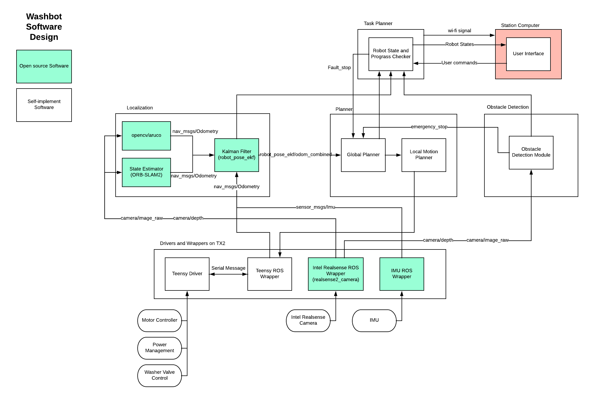

# WashBot
WashBot is a robotics capstone project at Carnegie Mellon University. The motivation of the project is to autonomously clean a designated driveway without human guidance, saving time, cost and ensuring safety for human operators.

## Software Architecture

## Get started
### Software Requirements
* Ubuntu 16.04
* ROS Kinetic
* OpenCV 3.0 (or higher)
* [TODO]

### Setup Software
[TODO]

## Documents
* [Put documents here]

## Copyright and License
This project is under GNU GENERAL PUBLIC LICENSE
